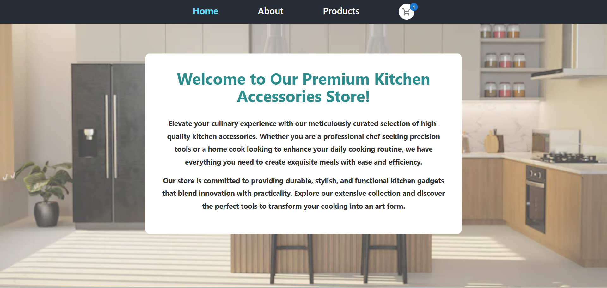
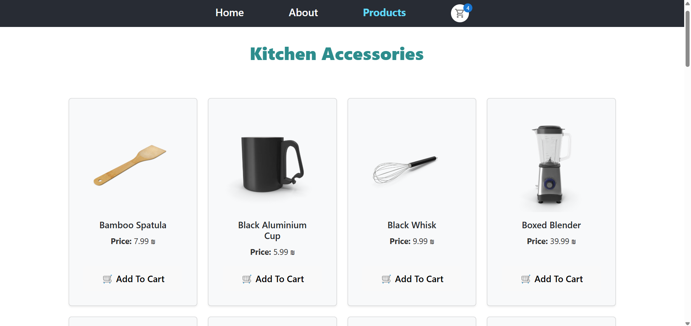
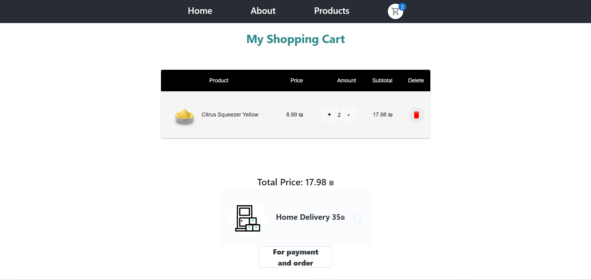

# 🛒 Online Store – Premium Kitchen Accessories

A **fully responsive and modern e-commerce web application** built with **React 19**, **Redux Toolkit**, **React Router v7**, **Material UI (MUI)**, and **Vite**.
This project provides a **seamless shopping experience** with live product data, a powerful cart system, and a polished, user-friendly UI.

---

## ✨ Key Features

* 🏠 **Landing Page:** Elegant and welcoming homepage with premium design.
* 📖 **About Page:** Store mission, values, and inspiration for cooking enthusiasts.
* 🛍️ **Dynamic Products Page:**

  * Real-time product data fetched from [DummyJSON API](https://dummyjson.com/products/category/kitchen-accessories).
  * Beautiful product cards with clean layout and imagery.
* 🛒 **Shopping Cart:**

  * Add, remove, and adjust product quantities.
  * Automatic subtotal and total calculations.
  * Optional **home delivery** with an extra fee.
  * Modal confirmation for order completion.
* 🔥 **Modern UI/UX:** Built with Material UI, Joy UI, and custom styles for a professional feel.
* 📱 **Fully Responsive:** Optimized for desktop, tablet, and mobile.
* ⚡ **State Management:** Scalable Redux Toolkit structure.
* 🎨 **Custom Styling:** Overlay effects, fixed navbar, and premium background visuals.
* 🧩 **Component-Based Architecture:** Clean separation of components for easy maintenance and scalability.

---

## 🛠️ Tech Stack

| Category           | Technology                |
| ------------------ | ------------------------- |
| Frontend Framework | React 19                  |
| State Management   | Redux Toolkit             |
| Routing            | React Router v7           |
| UI Components      | Material UI (MUI), Joy UI |
| Styling            | CSS Modules, Bootstrap    |
| API Data           | DummyJSON API             |
| Language           | JavaScript (ESNext)       |
| Build Tool         | Vite                      |

---

## 📂 Project Structure

```
src/
├── api/                # API request functions
├── assets/             # Static images and GIFs
├── components/         # Reusable UI components (Home, About, Cart, Product, etc.)
├── redux/              # Redux slices, store, and thunks
├── styles/             # Global and modular CSS
├── App.jsx             # Root application component
└── main.jsx            # Entry point
```

---

## 🚀 Getting Started

### 1️⃣ Clone the Repository

```bash
git clone https://github.com/YaelAvramsky/online-store.git
cd online-store
```

### 2️⃣ Install Dependencies

```bash
npm install
```

### 3️⃣ Start the Development Server

```bash
npm run dev
```

The app will be running at `http://localhost:5173/`.

---

## 🧪 Available Scripts

| Command           | Description                        |
| ----------------- | ---------------------------------- |
| `npm run dev`     | Run development server with Vite   |
| `npm run build`   | Build app for production           |
| `npm run preview` | Preview the production build       |
| `npm run lint`    | Run ESLint for code quality checks |

---

## 📸 Screenshots

| Homepage                               | Products Page                          | Cart Page                      |
| -------------------------------------- | -------------------------------------- | ------------------------------ |
|  |  |  |

---

## 🛡️ Best Practices

* 🔒 Environment variables via `.env`.
* 🧹 Code quality enforced with **ESLint**.
* 🗂️ Modular structure for scalability and readability.
* ⚡ Blazing-fast HMR and builds with **Vite**.

---

## 📄 License

This project is licensed under the [MIT License](LICENSE).

---

💡 *A modern, high-performance e-commerce app demonstrating best practices in React development, Redux state management, and UI/UX design.*
